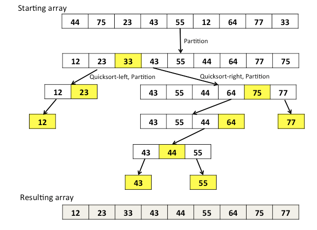

# 정렬(sort)

뒤죽박죽 섞여있는 데이터들을 어떻게 오름차순으로 정렬할 것인가?

### Bubble Sort (거품 정렬)

1. 첫 번째와 두 번째 데이터를 비교해서, 더 큰 데이터를 두 번째 데이터 위치에 둔다.
2. 두 번째와 세 번째 데이터를 비교해서, 더 큰 데이터를 세 번째 데이터 위치에 둔다.
3. N-1번째와 N번째 데이터를 비교해서, 더 큰 데이터를 N번째 데이터 위치에 둔다.
4. 여기까지 진행하면, 우선 제일 큰 데이터가 N번째에 위치하게 된다. (N번째 위치 확정)
5. 다시 1번부터 시작해서, 이번에는 N-2번째와 N-1번째 데이터까지 비교한다. (N번째 위치는 이미 확정 되었으므로)
6. 그 다음은 N-3번째와 N-2번째 까지 비교... 이런식으로 쭉 하다보면 마지막엔 첫 번째 데이터와 두 번째 데이터만 한 번 비교하고 끝이난다.
6. 이렇게되면 총 (N-1) + (N-2) + ... + 1 번, 즉, N(N-1)/2 번 비교하게 된다.
7. 즉, 시간 복잡도는 O(N<sup>2</sup>) 이다.

```
data : [5, 4, 3, 2, 1]

1. [4, 5, 3, 2, 1]
2. [4, 3, 5, 2, 1]
3. [4, 3, 2, 5, 1]
4. [4, 3, 2, 1, 5]  # N(5)번째 위치 확정

5. [3, 4, 2, 1, 5]
6. [3, 2, 4, 1, 5]
7. [3, 2, 1, 4, 5]  # N-1(4)번째 위치 확정

8. [2, 3, 1, 4, 5]
9. [2, 1, 3, 4, 5]  # N-2(3)번째 위치 확정

10. [1, 2, 3, 4, 5]  # 첫 번째, 두 번째 위치 확정
```

### Select Sort (선택 정렬)

1. 첫 번째부터 끝까지(N번째까지) 데이터를 훑고, 가장 작은 데이터를 첫 번째 위치에 둔다. (첫 번째 위치 확정)
2. 두 번째부터 끝까지(N번째까지) 데이터를 훑고, 가장 작은 데이터를 두 번째 위치에 둔다. (두 번째 위치 확정)
3. N-1 번째부터 N번째까지 데이터를 훑고, 가장 작은 데이터를 N-1번째 위치에 둔다. (N-1번째 위치 확정 & N번째 위치 자동 확정)
4. 마찬가지로 총 N(N-1)/2 번 비교하게 되지만, 교환 횟수가 평균적으로 Bubble Sort보다 적다
5. 시간 복잡도는 마찬가지로 O(N<sup>2</sup>) 이다.

```
data : [5, 4, 3, 2, 1]

1. [1, 4, 3, 2, 5]  # 첫 번째 위치에 가장 작은 1을 넣고, 기존에 있던 데이터(5)는 1이 있던 위치와 교체
2. [1, 2, 3, 4, 5]  # 두 번째 위치에 가장 작은 2를 넣고, 기존에 있던 데이터(4)는 2가 있던 위치와 교체
```

### Insert Sort (삽입 정렬)

1. 두 번째 데이터를 첫 번째 데이터와 비교해서 적절한 위치에 집어넣고, 나머지 데이터는 뒤로 민다
2. 세 번째 데이터를 첫 번째, 두 번째 데이터와 비교해서 적절한 위치에 집어넣고, 나머지 데이터는 뒤로 민다
3. N번째 데이터를 1 ~ N-1번째 데이터까지 비교해서 적절한 위치에 집어넣고, 나머지 데이터는 뒤로 민다
4. 마찬가지로 O(N<sup>2</sup>)의 시간 복잡도를 가진다.

```
data : [5, 4, 3, 2, 1]

1. [4, 5, 3, 2, 1]  # 4와 5를 비교해서 4를 5의 위치에 삽입하고, 5는 한 칸 뒤로 밀었다.
2. [3, 4, 5, 2, 1]  # 3과 5,4를 비교해서 3을 4의 위치에 삽입하고, 4,5는 한 칸씩 뒤로 밀었다.
3. [2, 3, 4, 5, 1]  # 2와 5,4,3을 비교해서 2를 3의 위치에 삽입하고, 3,4,5는 한 칸씩 뒤로 밀었다.
4. [1, 2, 3, 4, 5]  # 1과 5,4,3,2를 비교해서 1을 2의 위치에 삽입하고, 2,3,4,5는 한 칸씩 뒤로 밀었다.
```

### Merge Sort (합병 정렬)

1. 주어진 데이터 리스트를 반으로 쪼갠다
2. 반으로 쪼개진 각각의 데이터 리스트를 다시 반으로 쪼갠다
3. 모든 데이터 리스트의 길이가 1이 될때까지 계속 쪼갠다
4. 데이터를 다시 합치면서, 정렬한다
5. 우선 데이터를 반씩 쪼개는데 log<sub>2</sub>N 만큼의 시간이 든다
6. 다시 병합할때, 모든 데이터를 한 번씩 비교하므로 최대 N만큼의 시간이 든다
7. 최악의 상황에서는 모든 병합 과정에서 N번 정렬하게 되므로, 즉, log<sub>2</sub>N만큼 N번 정렬하게 되므로, 시간 복잡도는 O(Nlog<sub>2</sub>N) 이다

```
data = [3, 1, 5, 6, 8, 2, 9, 4, 10, 7] 

1. [3, 1, 5, 6, 8] [2, 9, 4, 10, 7]  # 리스트를 반으로 쪼갬
2. [3, 1] [5 ,6 ,8] [2, 9, 4] [10, 7]  # 반으로 쪼개진 리스트들을 다시 반으로 쪼갬
3. [3] [1] [5, 6] [8] [2] [9, 4] [10] [7]
4. [3] [1] [5] [6] [8] [2] [9] [4] [10] [7]  # 각 리스트의 길이가 1이 될때까지 전부 쪼갬

5. [1, 3] [5, 6] [2, 8] [4, 9] [7, 10]  # 쪼갰던 리스트끼리 정렬하며 병합
6. [1, 3, 5, 6] [2, 4, 8, 9] [7, 10]
7. [1, 3, 5, 6] [2, 4, 7, 8, 9, 10]
8. [1, 2, 3, 4, 5, 6, 7, 8, 9, 10]  # 같은 과정을 반복하며 최종적으로 정렬

```


### Quick Sort (퀵 정렬)

1. 정렬의 기준이 되는 데이터(Pivot)를 결정한다.
2. Pivot을 기준으로 더 작은 값들의 집합, 더 큰 값들의 집합으로 나눈다.
3. 이렇게 만들어진 각각의 집합에서 다시 1~2번의 동작을 반복한다.
4. 집합의 원소 갯수가 1개나 0이 될때까지 반복한다.
5. 최악의 경우(이미 정렬된 데이터에 대해 적용할 경우)시간복잡도는 O(N<sup>2</sup>) 이지만, 일반적인 경우 O(Nlog<sub>2</sub>N)의 시간복잡도를 가지는 알고리즘보다 빠른 성능을 보인다.
6. 이는 한 번 결정된 피벗들이 추후 연산에서 제외되기 때문이다.

```
data : [3, 1, 5, 6, 8, 2, 9, 4, 10, 7, 11] 
pivot : 6

1. [3, 1, 5, 4, 2] [6] [9, 7, 10, 11, 8]  # 6을 기준으로 작은것은 왼쪽, 큰것은 오른쪽
2. [2, 1] [3] [4, 5] [6] [7, 8] [9] [11, 10]  # 왼쪽 리스트에서 3을 기준으로 작은것은 왼쪽, 큰것은 오른쪽 | 오른쪽 리스트에서 9를 기준으로 작은것은 왼쪽, 큰것은 오른쪽
3. [] [1] [2] [3] [] [4] [5] [6] [] [7] [8] [9] [] [10] [11]  # 위와 같은 방식으로 다시 정렬 (빈 리스트는 pivot보다 작은 값이 없는 경우이다)
4. [1, 2, 3, 4, 5, 6, 7, 8, 9, 10, 11]  # 모든 리스트의 갯수가 1이나 0이 되었으므로 병합해서 정렬을 마무리한다.
```



[출처 : http://nate9389.tistory.com/130]